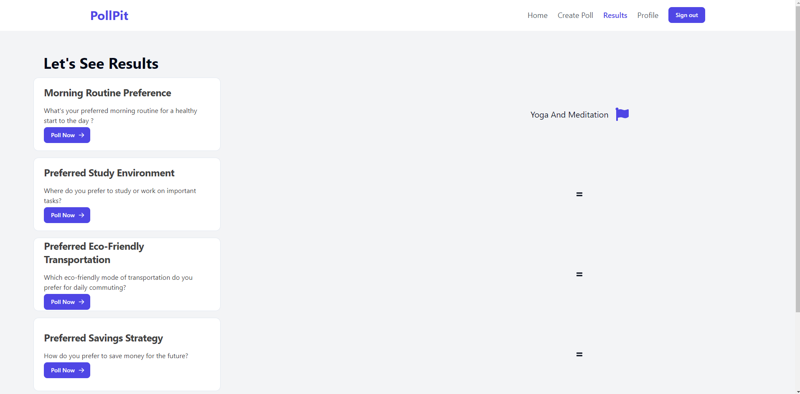

# PollPit

Welcome to PollPit! PollPit is a web application where users can create, participate in, and view the results of polls. Users can also comment on polls, and creators receive notifications for comments. The application features four main pages: Home Page, Create Poll Page, Results Page, and Profile Page, along with live notifications . PollPit utilizes React for the frontend, Node.js and Express for the backend, MongoDB for the database, Cloudinary for profile image uploading, and JWT for authentication and authorization.Voting on polls , commenting on polls and notifications all are realtime build using the websockets.

## Features

- **Poll Creation**: Users can create polls with titles, descriptions, and two options.
- **Poll Participation**: Users can vote on polls created by other users.
- **Poll Results**: Users can view the results of polls they have participated in.
- **Commenting**: Users can comment on polls.
- **Notifications**: Creators receive notifications when users comment on their polls.
- **Authentication**: Implemented JWT-based authentication for user login and authorization.

## Pages

### 1. Home Page


- **Features**:
  - Display a list of recent polls.
  - Navigate to other pages: Create Poll, Results, Profile.

### 2. Create Poll Page


- **Features**:
  - Form for creating new polls with title, description, and two options.

### 3. Results Page



- **Features**:
  - Display the results of a poll after a user has voted.

### 4. Profile Page


- **Features**:
  - Display user information such as username, email, polls created by the user and the polls on which the user has voted on .

## Technologies Used

- **Frontend**: React
- **Socket.io** 
- **Backend**: Node.js, Express
- **Database**: MongoDB
- **File Upload**: Cloudinary
- **Authentication**: JWT (JSON Web Tokens)

## Installation

1. Clone the repository:

   ```bash
   git clone <repository-url>
